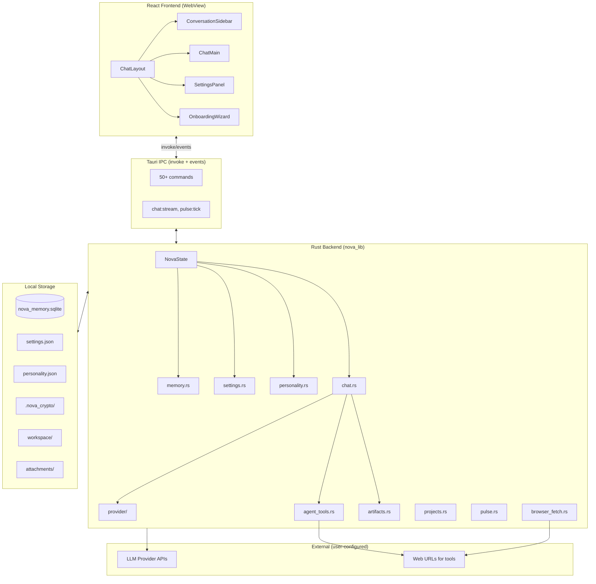
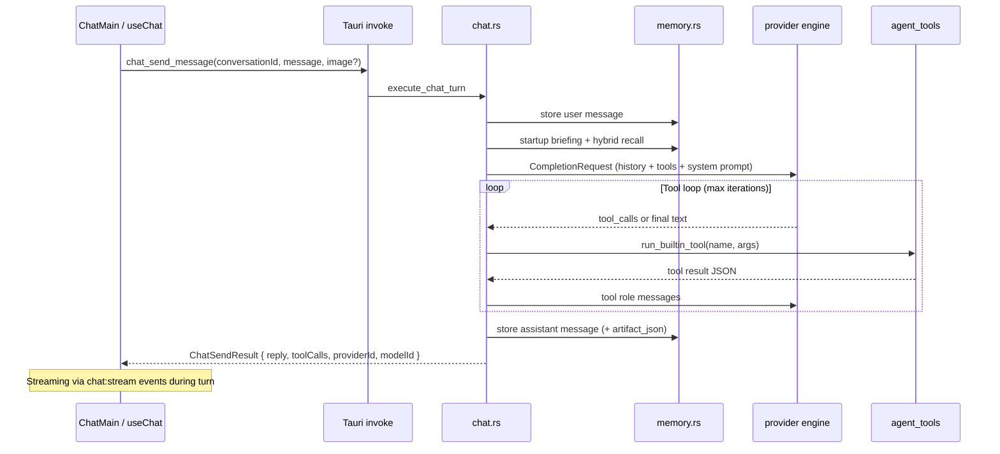
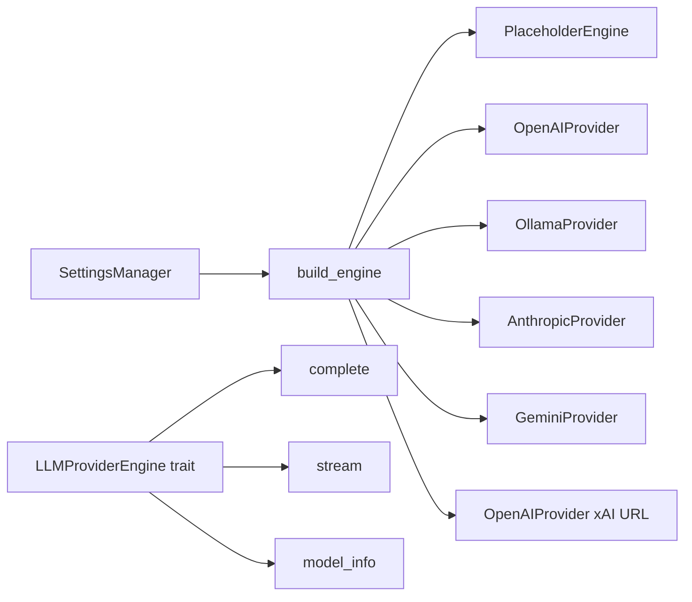

# 02 — Architecture

This document describes how Persistent Sage is built today (desktop v1.0.0) and how that architecture maps to an Android mobile application.

---

## System diagram (desktop)



---

## Layer responsibilities

### 1. React frontend (`src/`)

| Responsibility | Implementation |
|----------------|----------------|
| UI rendering | React 19 components, Tailwind CSS v4 |
| State management | Custom hooks (`useChat`, `useTheme`) — no Redux/React Query |
| Backend communication | `@tauri-apps/api/core` `invoke()` + event listeners |
| Artifact display | Sandboxed iframes (HTML/charts), `FormArtifact` component |
| Theme | Class-based dark mode on `html.dark`, `localStorage` persistence |
| Settings layout | `localStorage` for panel width mode (hidden/compact/full) |

**Entry points:**
- `main.tsx` → `App.tsx` → `ChatLayout` (primary window)
- `splash-main.tsx` → `SplashScreen` (desktop splash window only)

### 2. Tauri shell (`src-tauri/`)

| Responsibility | Implementation |
|----------------|----------------|
| App lifecycle | `nova_lib::run()` — shared desktop + mobile entry |
| IPC routing | `generate_handler!` registers all commands |
| Plugins | `dialog`, `process`, `updater` (desktop) |
| Window management | Splash → main window show (desktop-specific in `setup`) |
| Security | Capability allowlists in `capabilities/*.json` |

**Desktop binary:** `main.rs` calls `nova_lib::run()` — separate from library entry used on mobile.

**Mobile entry (already present):**

```710:711:src-tauri/src/lib.rs
#[cfg_attr(mobile, tauri::mobile_entry_point)]
pub fn run() {
```

**Cargo.toml library types for mobile:**

```9:11:src-tauri/Cargo.toml
[lib]
name = "nova_lib"
crate-type = ["staticlib", "cdylib", "rlib"]
```

### 3. Rust backend (`nova_lib`)

Central state object:

```52:62:src-tauri/src/lib.rs
pub struct NovaState {
    pub(crate) http: reqwest::Client,
    pub(crate) llm: tokio::sync::RwLock<Arc<dyn LLMProviderEngine + Send + Sync>>,
    pub(crate) memory: Arc<dyn ConversationMemory + Send + Sync>,
    pub(crate) settings: Arc<SettingsManager>,
    pub(crate) personality: Arc<PersonalityManager>,
    pub(crate) workspace_root: PathBuf,
    pub(crate) data_directory: PathBuf,
}
```

All Tauri commands receive `State<NovaState>` or `AppHandle` as needed.

### 4. Local storage

| Path (under data directory) | Contents |
|-----------------------------|----------|
| `nova_memory.sqlite` | Conversations, messages, anchors, projects, preferences |
| `settings.json` | App settings + encrypted API key blobs |
| `personality.json` | Companion profiles |
| `.nova_crypto/ikm`, `salt` | AES-256-GCM key derivation material |
| `workspace/` | Agent sandbox for file tools |
| `workspace/projects/` | Collaborative project documents |
| `workspace/guide.md` | Auto-seeded support guide |
| `attachments/` | Chat image files |
| `recipes.json` | Saved one-click workflows |

**Data directory resolution** (see `memory::default_db_path()`):

1. `PERSISTENT_SAGE_DATA_DIR` env var (or legacy `NOVA_DATA_DIR`) → portable SQLite profile
2. `PERSISTENT_SAGE_PORTABLE=1` → `{exe_dir}/data/` (desktop portable mode)
3. Default → `directories::ProjectDirs("app", "Persistent Sage", "Persistent Sage")` → desktop WAL profile

**Android implication:** Steps 2–3 need Android-specific resolution (app-private internal storage via Tauri/Android APIs). Step 1 may map to a user-selected directory via SAF.

---

## Chat turn data flow

This is the most important path for mobile parity.



**Streaming:** During the turn, Rust emits `chat:stream-start`, `chat:stream`, `chat:stream-error` events. Frontend shows a live assistant bubble.

**Pulse:** `pulse.rs` spawns a background loop that calls the same chat path with `silent_user_message: true`.

---

## Provider engine architecture



| Provider ID | Engine | API key required | Notes |
|-------------|--------|------------------|-------|
| `placeholder` | PlaceholderEngine | No | Offline stub |
| `openai` | OpenAIProvider | Yes | Chat Completions |
| `ollama` | OllamaProvider | No | Local Ollama |
| `ollama_cloud` | OllamaProvider | Yes | Ollama Cloud |
| `anthropic` | AnthropicProvider | Yes | Messages API + SSE |
| `gemini` | GeminiProvider | Yes | generateContent |
| `xai` | OpenAIProvider | Yes | xAI base URL |

All providers implement `LLMProviderEngine`: `complete()`, `stream()`, `model_info()`.

---

## Agent tools architecture

Tools are **not** separate Tauri commands. They execute inside the chat loop:

1. `chat.rs` assembles `Vec<ToolDefinition>` based on settings flags
2. LLM returns native `tool_calls` or XML `<function_calls>` fallback
3. `agent_tools::run_builtin_tool()` dispatches by name
4. Results fed back as `tool` role messages; loop continues until model finishes

Tool gating is settings-driven — see [03-BACKEND-REFERENCE.md](./03-BACKEND-REFERENCE.md) for the full list.

---

## Mobile architecture options

### Option A: Tauri 2 Android (recommended starting point)

**Rationale:** Maximum code reuse — same `nova_lib`, same React UI, same IPC surface.

| Reuse | Adapt |
|-------|-------|
| Entire Rust backend | Data directory resolution for Android |
| React components (with responsive pass) | Navigation: drawer/tabs instead of three-pane |
| All IPC commands | Desktop-only commands: stub or hide |
| SQLite schema + migrations | SQLite pragmas for mobile |
| Provider engines | Network permissions, certificate pinning (optional) |
| Settings encryption | Replace `keyring` with Android Keystore |

**Steps (high level):**
1. `tauri android init` — generates `gen/android/`
2. Define Android `identifier` (e.g. `app.persistentsage.mobile`)
3. Add mobile capability file
4. Gate desktop-only `setup()` (splash windows, updater plugin)
5. Responsive UI pass + Android navigation
6. Play Store signing + CI

### Option B: Native Android shell + shared Rust (FFI)

Higher effort; only if Tauri mobile limitations block critical features. Would require reimplementing IPC as JNI/UniFFI bindings.

### Option C: React Native / Flutter + Rust core

Maximum UI rewrite; only if team strongly prefers native mobile UI framework.

**Recommendation for planning:** Start with **Option A** unless the project summary identifies a blocking Tauri limitation.

---

## Desktop-only code paths to gate on Android

| Module / behavior | Why desktop-only |
|-------------------|------------------|
| `main.rs` | Desktop binary entry |
| Splash window setup in `run().setup()` | Two-window desktop pattern |
| `store_updates.rs` | Windows Store WinRT APIs |
| `distribution.rs` packaged-app detection | Windows `GetCurrentPackageFullName` |
| `browser_fetch.rs` | Headless Chrome binary |
| `tauri-plugin-updater` | GitHub release updater |
| `reveal_data_directory`, `open_path` | Desktop file manager integration |
| `browser_detect_chromium` | Chrome path detection |
| Portable mode (`PERSISTENT_SAGE_PORTABLE`) | USB exe-relative data dir |

Use `#[cfg(desktop)]` / `#[cfg(mobile)]` or runtime platform checks in both Rust and React (`AppPlatform` type currently only has `"desktop"`).

---

## Security model (unchanged on mobile)

| Asset | Encrypted? | Mobile note |
|-------|------------|-------------|
| API keys in `settings.json` | Yes (AES-256-GCM) | Key material in `.nova_crypto/` — evaluate Android Keystore integration |
| `nova_memory.sqlite` | No | Same policy; document in Play Store privacy section |
| `personality.json` | No | App-private storage |
| Chat attachments | No | Scoped storage |
| Agent workspace | No | App-private sandbox |

IPC allowlist: `src-tauri/permissions/nova-invoke-allowlist.toml` — mobile will need its own capability file.

---

## Build pipeline today vs mobile target

| Pipeline | Trigger | Output |
|----------|---------|--------|
| `build-windows.yml` | Tag `v*` | NSIS installer, portable zip, `latest.json` |
| `build-msix.yml` | Push to `main` | `PersistentSage_1.0.0.0_x64.msix` |
| **Mobile (TBD)** | TBD | APK/AAB for Play Store |

No mobile npm scripts exist yet. Desktop scripts for reference:

```json
"tauri": "tauri",
"msix:pack": "...",
"build:windows-installer": "npm run build && tauri build -- --bundles nsis"
```

Mobile equivalent would be: `tauri android dev`, `tauri android build`.

---

## Related documents

- [03-BACKEND-REFERENCE.md](./03-BACKEND-REFERENCE.md) — full IPC and module reference
- [04-FRONTEND-REFERENCE.md](./04-FRONTEND-REFERENCE.md) — UI structure and hooks
- [05-FEATURE-MATRIX.md](./05-FEATURE-MATRIX.md) — platform feature decisions
- [08-DECISIONS-AND-OPEN-QUESTIONS.md](./08-DECISIONS-AND-OPEN-QUESTIONS.md) — architecture decisions
